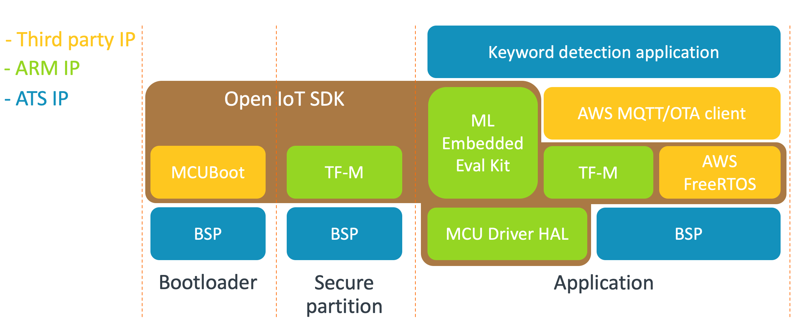

# Introduction

[Arm IoT Total Solutions](https://www.arm.com/solutions/iot/total-solutions-iot) provides a complete solution designed for specific use-cases, leaving developers to focus on what really matters – innovation and differentiation across diverse and varied use cases. It has everything needed to simplify the design process and streamline product development, including hardware IP, software, real-time OS support, machine learning (ML) models, advanced tools such as the new Arm Virtual Hardware, application specific reference code and support from the world’s largest IoT ecosystem.

# Overview

This repo contains Arm's first [IoT Total Solution](https://www.arm.com/solutions/iot/total-solutions-iot), "Keyword Detection".  It provides general-purpose compute and ML workload use-cases, including an ML-based keyword recognition example that leverages the DS-CNN model from the [Arm Model Zoo](https://github.com/ARM-software/ML-zoo).

The software supports multiple configurations of the Arm Corstone™-300 subsystem, incorporating the Cortex-M55 processor and Arm Ethos™-U55 microNPU.  This total solution provides the complex, non differentiated secure platform software on behalf of the ecosystem, thus enabling you to focus on your next killer app.

## Keyword detection application

The keyword detection application runs the DS-CNN model on top of [AWS FreeRTOS](https://docs.aws.amazon.com/freertos/). It detects keywords and inform the user of which keyword has been spotted. The audio data to process are injected at run time using the [Arm Virtual Hardware](https://www.arm.com/virtual-hardware) audio driver.

The Keyword application connects to [AWS IoT](https://docs.aws.amazon.com/iot/latest/developerguide/what-is-aws-iot.html) cloud to publish recognised keywords. AWS IoT cloud is also used for OTA firmware updates. These firmware updates are securely applied using [Trusted Firmware-M](https://tf-m-user-guide.trustedfirmware.org/). For more information, refer to the keyword detection [Readme](./kws/README.md).



## Blinky application

The blinky application demonstrate blinking LEDs using Arm Virtual Hardware. AWS FreeRTOS and FreeRTOS are already included in the application to kickstart new developments.


# Quick Start
Follow these simple steps to use this code example's keyword detection application.

## Launch Arm Virtual Hardware Instance

### Launch Using AWS Web Console
To utilize the Arm Virtual Hardware, you will need to create an [AWS Account](https://aws.amazon.com/) if you don’t already have one.

#### Launching the instance in EC2 [(AWS on getting started)](https://docs.aws.amazon.com/AWSEC2/latest/UserGuide/EC2_GetStarted.html)
1. Go to [EC2](https://console.aws.amazon.com/ec2/v2/) in the AWS Web Console.
1. Select **Launch Instances** which will take you to a wizard for launching the instance.

     1. **Step 1: Choose an [Amazon Machine Image (AMI)](https://docs.aws.amazon.com/AWSEC2/latest/UserGuide/AMIs.html)** - In the Search box, type `Arm Virtual Hardware` then find the item called "Arm Virtual Hardware" that is by Arm, and press Select for that item. This image contains all the software necessary to build and run the Arm IoT Total Solutions.
        This will raise a subscription page/pop-up titled, **Arm Virtual Hardware**. You will note that the subscription is free from Arm, but AWS does charge for the costs of the instances themselves according to the pricing chart provided.

        > Arm Virtual Hardware for Corstone-300 is available as a public beta on AWS Marketplace. To help you get started, AWS are offering more than 100 hours of free AWS EC2 CPU credits for the first 1,000 qualified users. Click here to find out more: https://www.arm.com/company/contact-us/virtual-hardware.

        You must select Continue if you want to move forward.

     1. **Step 2: Choose an Instance Type** - Select one of the instance types from the list. We recommend the **c5.large**. Keep in mind that there are charges that accrue while the instance is running.
        From here you may select **Review and Launch** to move directly to the launch page or select **Next: Configure Instance Details** if you need to set any custom settings for this instance.

#### Selecting the instance
Once you complete the wizard by initiating the instance launch you will see a page that allows you to navigate directly to the new instance. You may click this link or go back to your list of instances and find the instance through that method.

Whichever way you choose find your new instance and select its instance ID to open the page to manage the instance.

#### Connecting to the instance:
1. Select **Connect** to open an SSH terminal session to the instance in your browser.
1. Ensure the User name field is set to `ubuntu`.
1. Select the **Connect** button to open the session. This will put you in a browser window where you will have an SSH terminal window ready for your input.

### Launch Using a local terminal

1. Install [AWS CLI 2](https://docs.aws.amazon.com/cli/latest/userguide/install-cliv2.html) on your machine.
2. [Configure](https://docs.aws.amazon.com/cli/latest/userguide/cli-configure-quickstart.html) the access key, secret key and region that AWS CLI will use. If your organization uses AWS Single Sign-On, the [configuration process](https://docs.aws.amazon.com/cli/latest/userguide/cli-configure-sso.html) is slightly different. Make sure the region selected matches the region of the SSO service.
3. Create a new key pair.

```sh
aws ec2 create-key-pair --key-name MyKeyPair
```

4. When AWS CLI display the new key pair. Save the key material in a `.pem` file. The file permission must be set to `400`.

```sh
chmod 400 MyKeyPair.pem
```

5. Launch a new instance with the key pair created. The key pair can be reused to create new instances.

```sh
./scripts/vht_cli.py -k MyKeyPair start
```

#### Connecting to the instance:

1. Get the IP of the instance started

```sh
./scripts/vht_cli.py -k MyKeyPair status
```

2. Connect to the instance using SSH and the private key saved localy.

```sh
ssh -i "MyKeyPair.pem" ubuntu@<instance ip address>
```

## Build and execute the application

To update the application, a set of scripts is included to setup the environment,
build applications, run them and test them. These scripts must be executed in the AVH AMI.

### Connect

Open your favorite terminal program or linux shell application and connect to the AVH AMI instance:

```sh
ssh ubuntu@<your-ec2-instance>
```

### Prepare environment

Clone the repository in the AMI:

```sh
git clone <keyword repository> && cd <keyword repository>
```

Synchronize git submodules, setup ML and apply required patches:

```sh
./ats.sh bootstrap
```

Install additional python dependencies required to run tests and sign binaries:

```sh
sudo apt install python3.8-venv
```

```sh
python3.8 -m pip install imgtool cbor2
```

```sh
python3.9 -m pip install imgtool cffi intelhex cbor2 cbor pytest click
```

Make python user packages visible in the shell.

```sh
export PATH=$PATH:/home/ubuntu/.local/bin
```

### Build

There are currently two applications available: `blink` and `kws`.
The `ats.sh` scripts takes the command `bootstrap`, `build` or `run` as first  parameter.
The second parameter is the name of the application to build or run.
Below we use `kws` as the name of the application, replace it with `blinky` to build that instead.

Build the kws application:

```sh
./ats.sh build kws
```

This will by default build the application in the `build` directory for the `Corstone-300` target using the `FreeRTOS` OS. This is equivalent to:

```sh
./ats.sh build kws --target Corstone-300 --rtos FREERTOS --path build
```

To build for Corstone-310 use `--target Corstone-310`. To build using the RTX RTOS implementation use `--rtos RTX`.

You can have multiple builds with different parameters side by side by changing the `--path` parameter to something unique to each build configuration. This speed up the re-build process when working with multiple targets and RTOS.

### Run

Run the kws application:

```sh
./ats.sh run kws
```

The `run` command can take the `--path` switch to run a particular build. It uses `build` directory by default.
This is equivalent to:

```sh
./ats.sh run kws --path build
```

### Integration tests

Launch the kws integration tests:
```sh
pytest -s kws/tests/test_ml.py
```

## Updating audio data

The audio data streamed into the Arm Virtual Hardware is read from the file `test.wav` located at the root of the repository. It can be replaced with another audio file with the following configuration:
- Format: PCM
- Audio channels: Mono
- Sample rate: 16 bits
- Sample rate: 16kHz

# Continuous integration setup

Step by step instructions on how to setup a continuous integration pipeline in GitHub are provided in a mirror of this repository located at https://github.com/ARM-software/ATS-Keyword.


# Setting up AWS connectivity

The Keyword Detection application will attempt to connect to AWS IOT and report ML inference results through an MQTT connection. To connect to the AWS cloud service you will need to setup an IoT Thing and then set the AWS credentials of the IoT Thing within the Application. You will need to create an [AWS Account](https://aws.amazon.com/) if you don’t already have one.

## AWS account IoT setup

### Create an IoT thing for your device

1. Login to your account and browse to the [AWS IoT console](https://console.aws.amazon.com/iotv2/).
2. In the left navigation pane, choose **Manage**, and then choose **Things**.
3. If you do not have any IoT things registered in your account, the **You don’t have any things yet** page is displayed. If you see this page, choose **Register** a thing.
4. On the **Creating AWS IoT things** page, choose **Create a single thing**.
5. On the **Add your device to the thing registry** page, type a name for your thing (for example `MyThing`), and then choose **Next**. You will need to add the name later to your C code.
6. On the **Add a certificate for your thing** page, under **One-click certificate creation**, choose **Create certificate**.
7. Download your private key and certificate by choosing the **Download** links for each. Make note of the certificate ID. You need it later to attach a policy to your certificate.
8. Choose **Activate** to activate your certificate. Certificates must be activated prior to use.

### Create a policy and attach it to your thing

1. In the navigation pane of the AWS IoT console, choose **Secure**, and then choose **Policies**.
2. On the **Policies** page, choose **Create** (top right corner).
3. On the **Create a policy** page, enter a name for the policy. In the **Action** box, enter **iot:Connect**, **iot:Publish**, **iot:Subscribe**, **iot:Receive**. The **Resource ARN** box will be auto-filled with your credentials. Replace the part after the last colon (`:`) with `*`. Under **Effect**, check the **Allow** box. Click on **Create**.
4. In the left navigation pane of the AWS IoT console, choose **Secure**, and then choose **Certificates**. You should see the certificate that you have created earlier.
5. Click on the three dots in the upper right corner of the certificate and choose **Attach policy**.
6. In the **Attach policies to certificate(s)** window, enable the policy that you have just created and click **Attach**.

## Configure the application to connect to your AWS account

Edit `bsp/default_credentials/aws_clientcredential.h` file and set values of specified user defines.

`clientcredentialMQTT_BROKER_ENDPOINT`

Set this to the endpoint name of your amazon account. To find this go to the navigation pane of the [AWS IoT console](https://console.aws.amazon.com/iotv2/), choose **Settings**. On the **Settings** page, and copy the name of your **Endpoint** (such as `a3xyzzyx.iot.us-east-2.amazonaws.com`).

`clientcredentialIOT_THING_NAME`

Set this to the name of the thing you set (e.g. MyThing).

Next insert the keys that are in the certificates you have downloaded when you created the thing. Edit the file `bsp/default_credentials/aws_clientcredential_keys.h` replacing the existing keys with yours.

`keyCLIENT_CERTIFICATE_PEM`

Replace with contents from `<your-thing-certificate-unique-string>-certificate.pem.crt`.

`keyCLIENT_PRIVATE_KEY_PEM`

Replace with contents from `<your-thing-certificate-unique-string>-private.pem.key`.

`keyCLIENT_PUBLIC_KEY_PEM`

Replace with contents from `<your-thing-certificate-unique-string>-public.pem.key`.

## Observing MQTT connectivity

To see messages being sent by the application:
1. Login to your account and browse to the [AWS IoT console](https://console.aws.amazon.com/iotv2/).
2. In the left navigation panel, choose **Manage**, and then choose **Things**.
3. Select the thing you created, and open the **Activity** tab. This will show the application connecting and subscribing to a topic.
4. Click on the **MQTT test client** button. This will open a new tab.
5. The tab **Subscribe to a topic** should be already selected. Open the **Additional configuration** rollout.
6. In the topic filter field enter the topic name which is a concatenation of the name of your thing (set in `clientcredentialIOT_THING_NAME`) and `/ml/inference` (e.g. if you thing name is MyThing then it's `MyThing/ml/inference`)
7. In the **MQTT payload display** combo box select `Display payloads as strings (more accurate)`
8. Click the **Subscribe** button. The messages will be shown below.

# OTA firmware update

The application includes OTA update functionality. The application will check for updates from the AWS Cloud at boot time to check if there is an update pending.  If an update is available, the application will stop ML processing, download the new firmware, and then apply the new firmware if the version number indicates the image is newer. To make such a version available you need to prepare the update binary (this is part of the build process) and create an OTA job on AWS.

## Creating updated firmware

As part of the example build process an updated firmware will be created that will only differ in version number. That is enough to demonstrate the OTA process. If you want to add other changes you will have to copy the non-updated binary elsewhere before running the build again with your changes as the same build is used for both. The update binary is placed in `build/kws/kws_signed_update.bin`. This is already signed and is the file you will need to upload to a AWS bucket in the next section.

Upon completion of the build and sign process the signature string will be echoed. This will be needed in the next step.

## Creating AWS IoT firmware update job

1. [Create an Amazon S3 bucket to store your update](https://docs.aws.amazon.com/freertos/latest/userguide/dg-ota-bucket.html)
2. [Create an OTA Update service role](https://docs.aws.amazon.com/freertos/latest/userguide/create-service-role.html)
3. [Create an OTA user policy](https://docs.aws.amazon.com/freertos/latest/userguide/create-ota-user-policy.html)
4. Go to AWS IoT web interface and choose **Manage** and then **Jobs*
5. Click the create job button and select **Create FreeRTOS OTA update job**
6. Give it a name and click next
7. Select the device to update (the Thing you created in earlier steps)
8. Select `MQTT` transport only
9. Select **Use my custom signed file**
10. Paste the signature string that is echoed during the build of the example (it is also available in `build/kws/update-signature.txt`).
11. Select `SHA-256` and `RSA` algorithms.
12. For **Path name of code signing certificate on device** put in `0` (the path is not used)
13. Select upload new file and select the signed update binary (`build/kws/kws_signed_update.bin`)
14. Select the S3 bucket you created in step 1. to upload the binary to
15. For **Path name of file on device** put in `non_secure image`
16. As the role, select the OTA role you created in step 2.
17. Click next
18. Click next, your update job is ready and running - next time your application connects it will perform the update.

# Terminating AMI Instance at the end of the day

## Stopping the instance in EC2 [(AWS on getting started)](https://docs.aws.amazon.com/AWSEC2/latest/UserGuide/EC2_GetStarted.html)
1. Go to [EC2](https://console.aws.amazon.com/ec2/v2/) in the AWS Web Console.
2. Select the instance to stop.
3. Click on `Instance state` and select `Stop Instance` in the drop down menu.

## Stopping the instance using a local terminal

```sh
./scripts/vht_cli.py -k MyKeyPair stop
```

# Source code overview

- `bsp`: Arm Corstone™-300 subsystem platform code and AWS configurations.
- `lib`: Middleware used by IoT Total Solution.
  - `lib/mcuboot`: MCUboot bootloader.
  - `lib/tf-m`: Trusted Firmware M: [Platform Security Architecture](PSA) for Armv8-M.
  - `lib/mbedcrypto`: Mbed TLS and PSA cryptographic APIs.
  - `lib/ml-embedded-evaluation-kit`: Arm® ML embedded evaluation kitr Ethos NPU. It includes [TensorFlow](https://www.tensorflow.org/)
  - `lib/amazon_freertos`: AWS FreeRTOS distribution.
  - `libVHT`: Virtual streaming solution for Arm Virtual Hardware.
- `blinky`: Blinky application.
  - `blinky/main_ns.c`: Entry point of the blinky application
- `kws`: Keyword detection application.
  - `kws/source/main_ns.c`: Entry point of the kws application.
  - `kws/source/blinky_task.c`: Blinky/UX thread of the application.
  - `kws/source/ml_interface.c`: Interface between the virtual streaming solution and tensor flow.

# ML Model Replacement

All the ML models supported by the [ML Embedded Eval Kit](All the models supported ) are available to applications. The first step to use another module is to generate sources files from its labels and `.tflite` model.

```sh
# Enter the ml example repository
cd lib/ml-embedded-evaluation-kit/

ML_GEN_SRC="generated/<model name>/src"
ML_GEN_INC="generated/<model name>/include"

mkdir -p $ML_GEN_SRC
mkdir -p $ML_GEN_INC

./lib/ml-embedded-evaluation-kit/resources_downloaded/env/bin/python3 scripts/py/gen_labels_cpp.py \
    --labels_file resources/<model name>/labels/<label file>.txt \
    --source_folder_path $ML_GEN_SRC \
    --header_folder_path $ML_GEN_INC \
    --output_file_name <model name>_labels
./resources_downloaded/env/bin/python3 scripts/py/gen_model_cpp.py \
    --tflite_path resources_downloaded/<model name>/<model>.tflite \
    --output_dir $ML_GEN_SRC
```

Models available are present in `./lib/ml-embedded-evaluation-kit/resources_downloaded`.
Pre-integrated source code is available from the `ML Embedded Eval Kit` and can be browsed from `./lib/ml-embedded-evaluation-kit/source/use_case`.

Integrating a new model means integrating its source code and requires update of the build files.

# ML Embedded Eval Kit

The Arm ML Embedded Evaluation Kit , is an open-source repository enabling users to quickly build and deploy embedded machine learning applications for Arm Cortex-M55 CPU and Arm Ethos-U55 NPU.

With ML Eval Kit you can run inferences on either a custom neural network on Ethos-U microNPU or using availble ML applications such as [Image classification](https://review.mlplatform.org/plugins/gitiles/ml/ethos-u/ml-embedded-evaluation-kit/+/c930ad9dc189d831ac77f716df288f70178d4c10/docs/use_cases/img_class.md), [Keyword spotting (KWS)](https://review.mlplatform.org/plugins/gitiles/ml/ethos-u/ml-embedded-evaluation-kit/+/c930ad9dc189d831ac77f716df288f70178d4c10/docs/use_cases/kws.md), [Automated Speech Recognition (ASR)](https://review.mlplatform.org/plugins/gitiles/ml/ethos-u/ml-embedded-evaluation-kit/+/c930ad9dc189d831ac77f716df288f70178d4c10/docs/use_cases/asr.md), [Anomaly Detection](https://review.mlplatform.org/plugins/gitiles/ml/ethos-u/ml-embedded-evaluation-kit/+/c930ad9dc189d831ac77f716df288f70178d4c10/docs/use_cases/ad.md), and [Person Detection](https://review.mlplatform.org/plugins/gitiles/ml/ethos-u/ml-embedded-evaluation-kit/+/HEAD/docs/use_cases/visual_wake_word.md) all using Arm Fixed Virtual Platform (FVP) available in Arm Virtual Hardware.

# Known limitations

- Arm compiler 6 is the only compiler supported.
- Accuracy of the ML detection running alongside cloud connectivity depends on the performance of the EC2 instance used. We recommend to use at least a t3.medium instance.
- Arm Corstone™-300 subsystem simulation is not time accurate. Performances will differ depending on the performances of the host machine.


# Future Enhancements
- [AWS Partner Device Catalog Listing](https://devices.amazonaws.com/) (leveraging Arm Virtual Hardware)
- cmake

# Other Resources

| Repository                                                                                                    | Description                                                                                                                                                                                                                        |
|---------------------------------------------------------------------------------------------------------------|------------------------------------------------------------------------------------------------------------------------------------------------------------------------------------------------------------------------------------|
| [Arm AI Ecosystem Catalog](https://www.arm.com/why-arm/partner-ecosystem/ai-ecosystem-catalog)                | Connects you to the right partners, enabling you to build the next generation of AI solutions                                                                                                                                      |
| [Arm IoT Ecosystem Catalog](https://www.arm.com/why-arm/partner-ecosystem/iot-ecosystem-catalog)              | Explore Arm IoT Ecosystem partners who can help transform an idea into a secure, market-leading device.                                                                                                                            |
| [Arm ML Model Zoo](https://github.com/ARM-software/ML-zoo)                                                    | A collection of machine learning models optimized for Arm IP.                                                                                                                                                                      |
| [Arm Virtual Hardware Documentation](https://mdk-packs.github.io/VHT-TFLmicrospeech/overview/html/index.html) | Documentation for [Arm Virtual Hardware](https://www.arm.com/products/development-tools/simulation/virtual-hardware)                                                                                                               |
| [Arm Virtual Hardware source code](https://github.com/ARM-software/VHT)                                       | Source code of[Arm Virtual Hardware](https://www.arm.com/products/development-tools/simulation/virtual-hardware)                                                                                                               |
| [AWS FreeRTOS Documentation](https://docs.aws.amazon.com/freertos/)                                           | Documentation for AWS FreeRTOS.                                                                                                                                                                                                    |
| [AWS FreeRTOS source code](https://github.com/aws/amazon-freertos)                                            | Source code of AWS FreeRTOS.                                                                                                                                                                                                      |
| [AWS IoT](https://docs.aws.amazon.com/iot/latest/developerguide/what-is-aws-iot.html)                         | Documentation for AWS IoT.                                                                                                                                                                                                         |
| [Trusted Firmware-M Documentation](https://tf-m-user-guide.trustedfirmware.org/)                              | Documentation for Trusted Firmware-M.                                                                                                                                                                                               |
| [Trusted Firmware-M Source code](https://git.trustedfirmware.org/TF-M/trusted-firmware-m.git)                 | Source code of Trusted Firmware-M.                                                                                                                                                                                               |
| [Mbed Crypto](https://github.com/ARMmbed/mbedtls)                                                             | Mbed Crypto source code.                                                                                                                                                                                               |
| [MCU Boot](https://github.com/mcu-tools/mcuboot)                                                              | MCU Boot source code.                                                                                                                                                                                               |
| [ml-embedded-evaluation-kit](https://review.mlplatform.org/plugins/gitiles/ml/ethos-u/ml-embedded-evaluation-kit) | ML Embedded eval kit source code |
| Support                                                                                                       | A [community.arm.com](http://community.arm.com/) forum exists for users to post queries. INTERNAL NOTE →   they have – already set up on the test environment (link).  This will be moved to the live environment on 19th October. |

# License and contributions

The software is provided under the Apache-2.0 license. All contributions to software and documents are licensed by contributors under the same license model as the software/document itself (ie. inbound == outbound licensing). Open IoT SDK may reuse software already licensed under another license, provided the license is permissive in nature and compatible with Apache v2.0.

Folders containing files under different permissive license than Apache 2.0 are listed in the LICENSE file.

## Security issues reporting

If you find any security vulnerabilities, please do not report it in the GitLab issue tracker. Instead, send an email to the security team at arm-security@arm.com stating that you may have found a security vulnerability in the IoT Total Solution Keyword Detection project.

More details can be found at [Arm Developer website](https://developer.arm.com/support/arm-security-updates/report-security-vulnerabilities).
